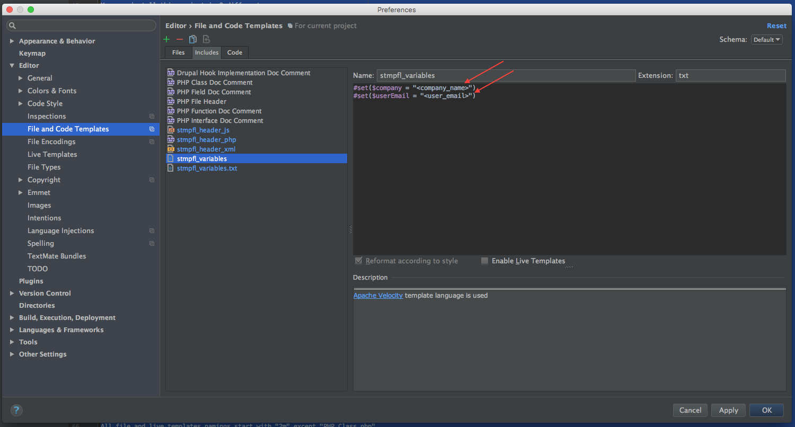

# Magento 2 PHPStorm Preferences

This project is intended to setup useful PHPStorm Templates for Magento 2 Projects.

## Disclaimer

This project overrides the default file template `PHP Class.php` to add a specific header comments. 
We need to edit this file instead of creating a new one because automatic Namespace only works on this specific template.
All other templates are custom ones with a naming prefix `2m` in order to make them unique.

## Installation

0. Just download the `.jar` file and import it in your PHPStorm `File -> Import` 

    * `https://github.com/staempfli/magento2-phpstorm-templates/releases/<version>/settings.jar`

0. Set your personal configuration for comments on PHPStorm `Preferences -> Editor -> File and Code Templates -> stmpfl_variables`

    

## Available Templates

* [File Templates](docs/fileTemplates.md)
* [Live Templates](docs/liveTemplates.md)

## Usage

All file and live templates namings start with `2m` except `PHP Class.php`. 
We need to use the default `PHP Class.php` because automatic Namespace only works on this specific template.

## Contribute

You can contribute with new templates following this manual:

* [Contribute manual](./docs/contribute.md)
